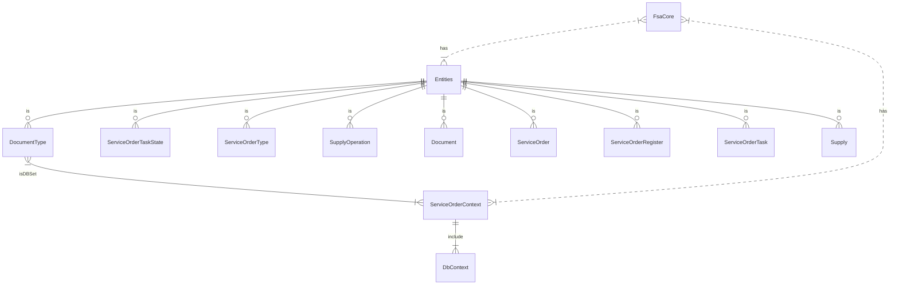

1- Set "traefik-dashboard.cu" hostname on Hosts file (C:\Windows\System32\drivers\etc\hosts) and "whoami.localhost".
2- C:\Users\potli\OneDrive\Documentos\traefik-docker
3- docker-compose up -d
4- docker-compose -f "whoami.yml" up -d O docker-compose -f "whoami.yml" up -d --scale whoami=4
5- access to "traefik-dashboard.cu" via web.
6- test "whoami.localhost" via web and verify ip that respond.

google: traefik cannot access to ip address for the container
https://stackoverflow.com/questions/54007788/cant-get-correct-container-ip-using-traefik
https://stackoverflow.com/questions/68456004/cant-connect-to-a-docker-container-using-its-ip-address
https://www.reddit.com/r/Traefik/comments/11r4ssb/traefik_using_containers_ip_instead_of_hosts/

